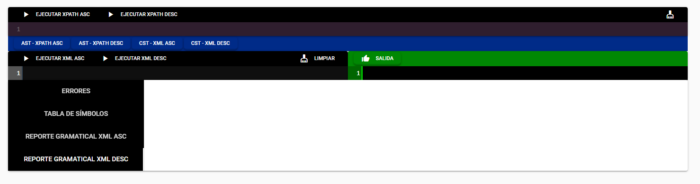
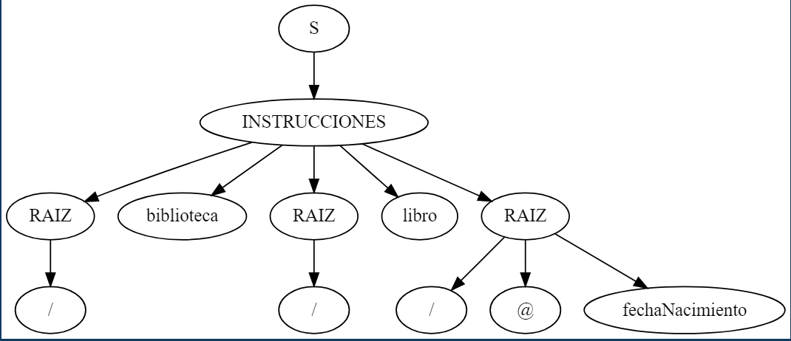
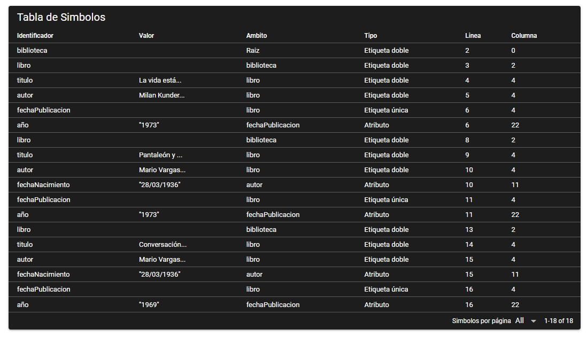
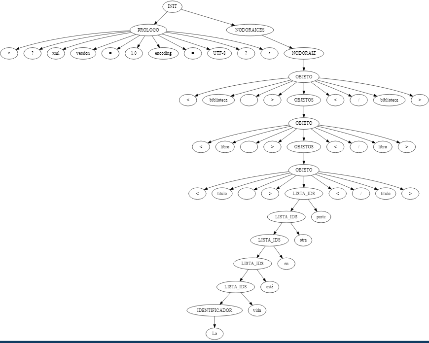
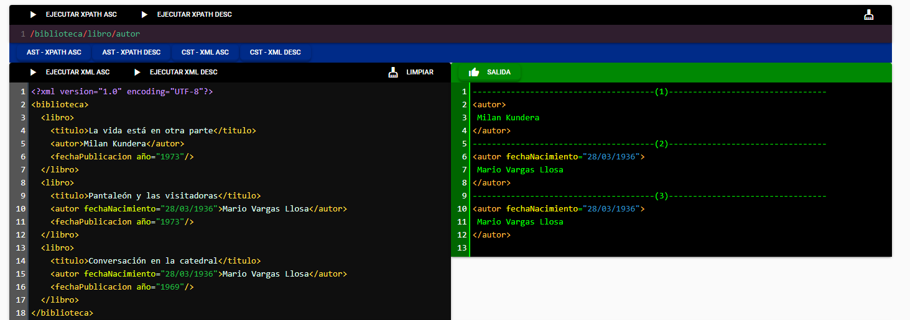

Universidad de San Carlos de Guatemala  
Facultad de Ingeniería  
Escuela de Ciencias y Sistemas  
Organización de Lenguajes y Compiladores 2        
Sección A

_____

# **Manual de Usuario**

**Contenido**   
1. [Introduccion](#id1)
2. [Objetivo del manual](#id2)
3. [Instalación](#id3)
4. [IDE](#id4)
5. [Reportes](#id5)

## **Introducción**
***
En el siguiente escrito se proporciona una guía de usuario para aquellas personas interesadas en utilizar el software "TytusX". Además, se describen los objetivos e información clara de cómo utilizarlo para aprovecharlo de la mejor manera posible.

TytusX es un administrador de bases de datos diseñado para almacenar datos que se encuentre en archivos ".XML". Para obtenerla se hace uso de consultas bajo la sintaxis del lenguaje "XPath".

Para la gestión de la información con TytusX deberá de introducirse por medio de la consola de inicio. Esta debe de seguir las reglas léxicas y sintácticas propias del lenguaje ".XML" para evitar inconvenientes al momento de realizar la carga. Una vez se posee la información se podrá acceder a ella por medio de consultas que estarán bajo los lineamientos del lenguaje "XPath" utilizando la consola de consultas. La información resultante se mostrará en la consola de igual forma.

## **Objetivo del manual**
***
El objetivo primordial del manual de usuario es el de guiar, ayudar y resolver las dudas que el usuario tenga mientras utiliza el software TytusX.  Se presentará una sección donde se le guiará al usuario en su instalación, se ilustrarán algunos pasos para su utilización y se indicará lo necesario para su uso entre otros aspectos. Para conocer las herramientas y la lógica empleada en la construcción del proyecto se debe consultar el ["Manual Técnico de TytusX"](./Manual%20Técnico.md).

## **Instalación**
***

### Requisitos Previos 
- Tener instalado node js y npm
- Tener un ide para correr el proyecto, se recomienda el uso de visual studio code
  
### Pasos para la instalación 
- Clonar el repositorio en su maquina local o descargar el .zip del código
- Abrir el proyecto en el ide por defecto 
- Abrir la terminal del proyecto y colocar el siguiente comando, para poder instalar todos los complementos necesarios. 
            
                        npm install 

- Con el siguiente comando se ejecuta el proyecto  
                    
                            quasar dev 

## **IDE**
***

Al iniciar a ejecutarse la aplicación se abrirá una pestaña en el navegador que mostrará una ventana con el IDE del proyecto, como la imagen adjunta. 

  

## **REPORTES**
***

### AST - XPATH

Este reporte mostrará el árbol sintáctico que se produjo al analizar el archivo de entrada.

  

### Tabla de Simbolos - XML 

Este reporte mostrará la tabla de símbolos después de la ejecución del archivo, muestra cada uno de los objetos recolectados durante el analizador y su información mas importante.

  

### CST - XML 

Se desplegará una sección que mostrará el árbol que se produjo al analizar el archivo de entrada. Tanto para el analizador ascendente como para el descendente.

  

### Reporte Gramatical 

Reporte que muestra cada una de las producciones que se ejecutaron durante el analisis del proyecto.

  

### Consulta

En el primer recuadro se debe de ingresar la consulta, es importante recalcar que antes de ejecutar la consulta, se debe agregar el codigo xml y analizarlo, de lo contrario se producirá un error. En el lado inferior derecho se mostrará la salida de la consulta. 

  

